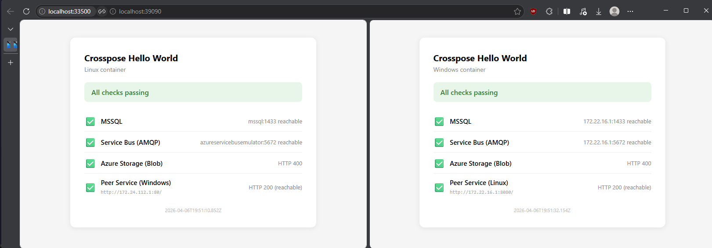

# Cross-Platform Helm Chart Hello World

A minimal Helm chart that deploys a Linux service and a Windows service side-by-side, each validating connectivity to shared infrastructure and to each other. Designed as a test fixture for [Crosspose](https://github.com/andrewiankidd/crosspose).

## What it tests

| Check | Purpose |
|-------|---------|
| MSSQL | TCP connection to SQL Server (port 1433) |
| Service Bus | TCP connection to Azure Service Bus Emulator (AMQP 5672) |
| Azure Storage | HTTP probe against Azurite blob endpoint (port 10000) |
| Peer Service | HTTP call from Windows container to Linux, and vice-versa |

Each container serves an HTML status page on its root path with green/red indicators for each check. Returns HTTP 200 when all pass, 503 when any fail. This endpoint doubles as the container healthcheck.

## Repository layout

```
chart/                  Helm chart (Deployments + Services)
images/
  server.js             Shared Node.js health-check server (zero npm deps)
  linux/Dockerfile      Linux image (node:22-alpine)
  windows/Dockerfile    Windows image (node:22-windowsservercore-ltsc2022)
crosspose/
  values.yaml           Values file for Crosspose dekompose
  dekompose.yml         Dekompose config (infra: MSSQL, Service Bus, Azurite)
```

## Use with Crosspose

1. Pull or package the chart, then open it in Crosspose GUI:

```powershell
# Package locally
helm package chart/ -d dist/

# Or pull from GHCR
helm pull oci://ghcr.io/andrewiankidd/charts/cross-platform-hello
```

2. In Crosspose GUI, select the chart from **Helm Charts**, set the values file to `crosspose/values.yaml` and dekompose config to `crosspose/dekompose.yml`.

3. Click **Dekompose** — this generates compose files split by OS, with infra services (MSSQL, Service Bus emulator, Azurite) and port proxy requirements.

4. **Deploy** from Compose Bundles, then watch the containers come up in the **Containers** view.

5. Open the Linux container's mapped port in a browser — you should see all four checks green. Same for the Windows container.

## Build images locally

```bash
# Copy shared server into build contexts
cp images/server.js images/linux/server.js
cp images/server.js images/windows/server.js

# Linux (Podman or Docker)
docker build -t ghcr.io/andrewiankidd/crossplatform-helm-chart-hello-world-linux:latest images/linux/

# Windows (Docker Desktop in Windows container mode)
docker build -t ghcr.io/andrewiankidd/crossplatform-helm-chart-hello-world-windows:latest images/windows/
```

## Install on Kubernetes (without Crosspose)

```bash
helm install hello chart/ -f crosspose/values.yaml
kubectl get pods -w
```

## Infrastructure

The `crosspose/dekompose.yml` defines three infra services that Crosspose provisions automatically:

- **MSSQL 2022** — `mcr.microsoft.com/mssql/server:2022-latest` with SA password and healthcheck
- **Azure Service Bus Emulator** — `mcr.microsoft.com/azure-messaging/servicebus-emulator:latest`
- **Azurite** — `mcr.microsoft.com/azure-storage/azurite:latest` (blob, queue, table)

## Screenshot


